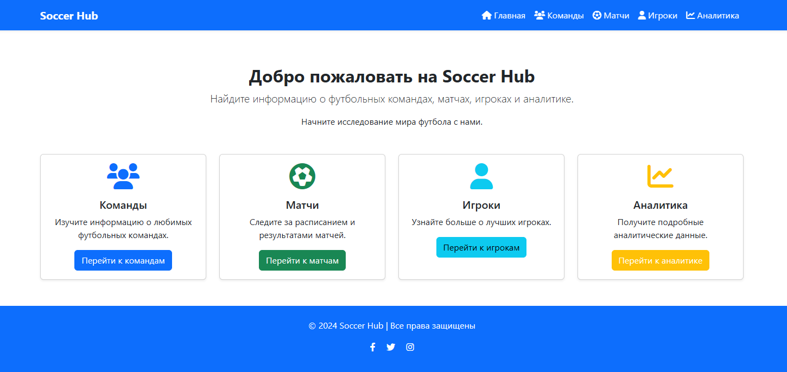
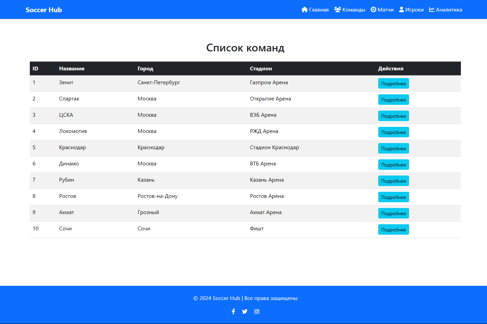
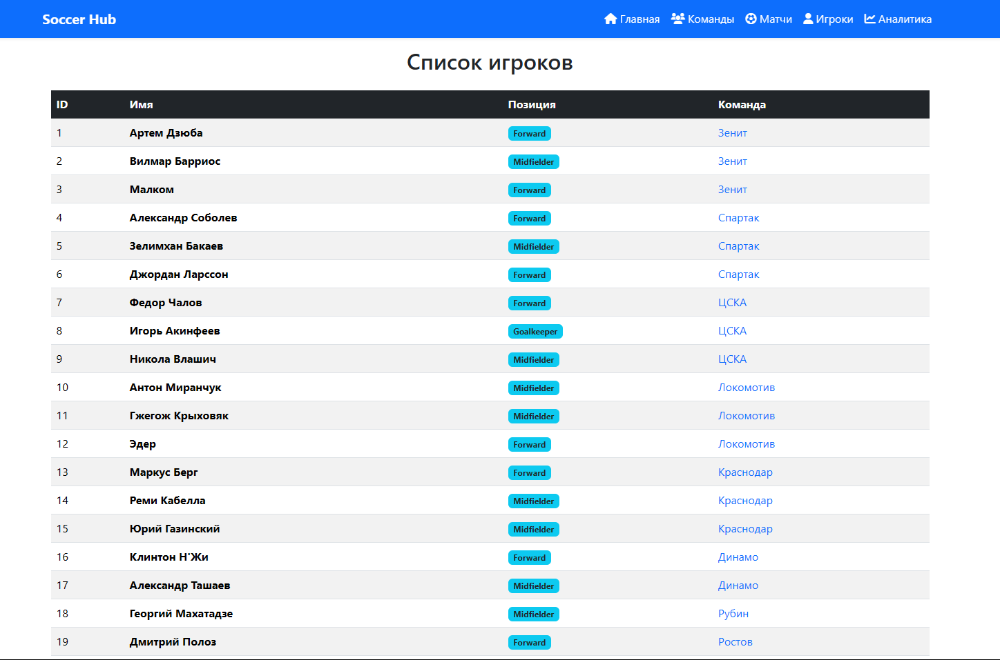
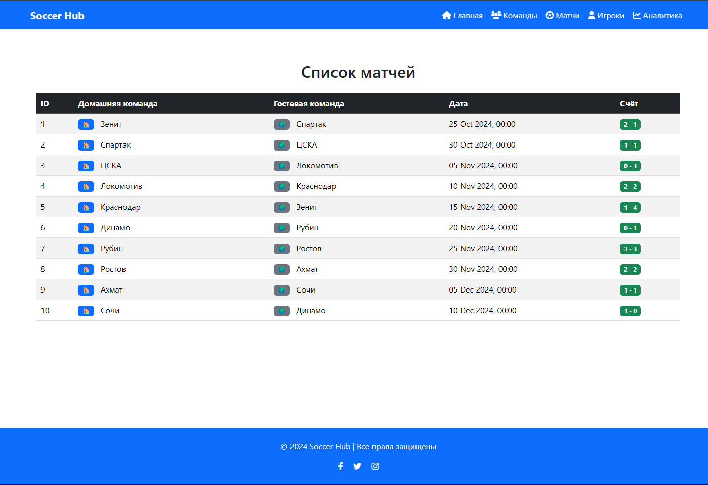
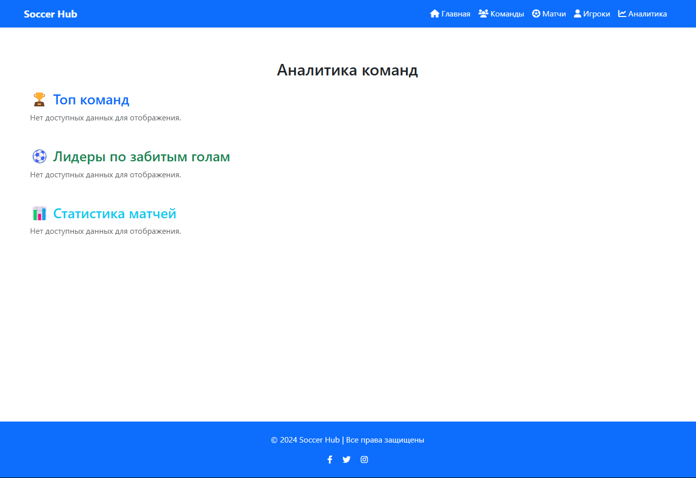

# Soccer Hub


**Soccer Hub** — это веб-приложение, разработанное на фреймворке `FastAPI`, которое предоставляет API для управления информацией о футбольных командах, матчах и аналитикой. Проект ориентирован на поддержку адаптивного дизайна, что позволяет пользователям удобно получать доступ к данным с различных устройств. Приложение также включает в себя систему аналитики для отслеживания посещаемости и действий пользователей.

---

## Цели проекта

1. Создать `RESTful API` для взаимодействия с данными о футбольных командах и матчах.
2. Обеспечить возможность сбора и анализа данных о посещаемости и действиях пользователей.
3. Обеспечить адаптивный интерфейс, удобный для использования на различных устройствах.
4. Реализовать безопасное взаимодействие с данными, включая аутентификацию и авторизацию пользователей.

---

## Структура проекта

```
soccer_hub/
├── app/
│   ├── __init__.py           # Инициализация FastAPI приложения
│   ├── main.py               # Запуск приложения
│   ├── core/
│   │   ├── config.py         # Конфигурации приложения
│   │   └── security.py       # Функции безопасности
│   │
│   ├── db/
│   │   ├── database.py       # Подключение к базе данных
│   │   ├── models.py         # Модели данных
│   │   └── schemas.py        # Схемы Pydantic для валидации
│   │
│   ├── routes/               # API маршруты
│   │   ├── __init__.py       # Инициализация маршрутов
│   │   ├── analytics.py      # Маршруты аналитики
│   │   ├── players.py        # Маршруты игроков
│   │   ├── teams.py          # Маршруты команд
│   │   └── matches.py        # Маршруты матчей
│   │
│   ├── services/             # Логика бизнес-процессов
│   │   ├── team_service.py   # Сервис для работы с командами
│   │   └── match_service.py  # Сервис для работы с матчами
│   │
│   ├── templates/            # HTML шаблоны
│   │   ├── base.html         # Основной шаблон
│   │   ├── index.html        # Главная страница
│   │   ├── analytics.html    # Страница аналитики
│   │   ├── matches.html      # Страница матчей
│   │   ├── players.html      # Страница игроков
│   │   ├── team.html         # Подробнее о команде
│   │   └── teams.html        # Страница команд
│   │
│   ├── static/               # Статические файлы (CSS, JS, изображения)
│   │   ├── css/              # Файлы стилей
│   │   ├── js/               # Файлы скриптов
│   │   └── images/           # Фотографии
│   │
│   └── analytics/            # Аналитика посещаемости и действий
│
├── tests/                    # Тесты для приложения
│   ├── test_routes.py        # Тесты для маршрутов
│   └── test_services.py      # Тесты для сервисов
│
├── add_data.py               # Добавление данных в БД
├── create_db.py              # Создание базы данных
│
├── .env                      # Переменные окружения
├── .gitignore                # Файлы и папки, которые нужно игнорировать в Git
├── alembic/                  # Миграции базы данных (если используем Alembic)
│   └── env.py                # Конфигурация миграций
│
├── docker-compose.yml        # Docker для контейнеризации (опционально)
├── README.md                 # Описание репозитория проекта
├── requirements.txt          # Зависимости проекта
└── run.py                    # Точка входа для запуска проекта
```

---

## Используемые технологии

1. **FastAPI:** Фреймворк для создания высокопроизводительных API.
2. **Pydantic:** Для валидации и сериализации данных.
3. **SQLAlchemy:** ORM для работы с базой данных.
4. **Alembic:** Миграции базы данных.
5. **Docker:** Для контейнеризации приложения (опционально).

---

## Примеры интерфейса







---

## Запуск проекта

Чтобы запустить проект, выполните следующие шаги:

1. Убедитесь, что у вас установлен `Python 3.7` или выше.
2. Создайте виртуальное окружение и активируйте его:
    ```bash
    python -m venv env
    source env/bin/activate  # Для Windows используйте `env\Scripts\activate`
    ```
3. Установите зависимости из файла `requirements.txt`:
    ```bash
    pip install -r requirements.txt
    ```
4. Настройте переменные окружения в файле `.env`.
5. Создайте базу данных (если необходимо):
    ```bash
    python create_db.py
    ```
6. Добавьте данные в базу данных (если необходимо):
    ```bash
    python add_data.py
    ```
7. Запустите приложение:
    ```bash
    python run.py
    ```
8. Перейдите по адресу `http://localhost:8000` для доступа к `API`.

Дополнительно, для запуска с использованием Uvicorn:
```bash
uvicorn app.main:app --reload
```

---

### 📄 Лицензия

[Этот проект лицензирован под лицензией MIT](LICENCE)

Для получения дополнительной информации ознакомьтесь с файлом `LICENSE`

---

## Автор

**Дуплей Максим Игоревич**

**Дата:** 15.10.2024 - 30.10.2024

**Версия:** 1.0

